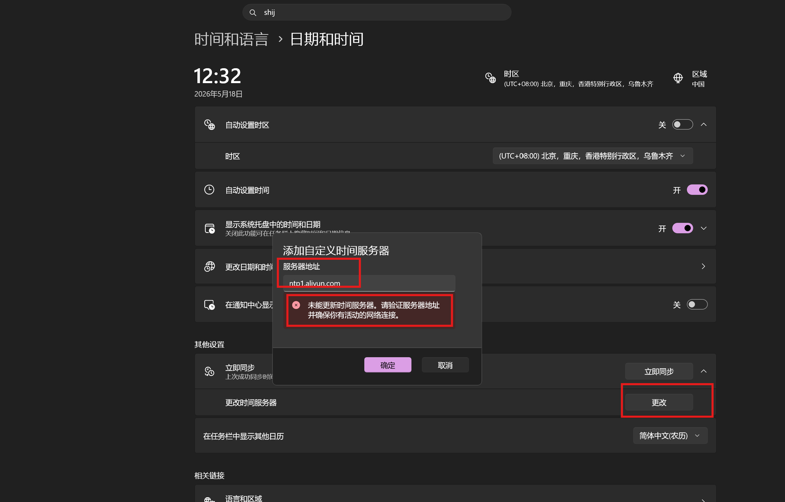

# windows-sntp-sync.ps1

使用脚本 [windows-sntp-sync.ps1](./windows-sntp-sync.ps1) 绕过 Windows Time Service，通过独立 SNTP 请求校准 Windows 系统时间。适合 `w32tm /stripchart` 能拿到 NTP 样本，但 `w32time` 一直停在 `Local CMOS Clock` 的情况。🕒

## 1. 🧭 场景

现象: `win11`的`设置`-> `时间和语言`-> `日期和时间` -> `其他设置` -> `更改时间服务器`失败。



执行下面命令时间同步服务查询命令，显示
```powershell
➜ w32tm /query /status
Leap 指示符: 3(未同步)
层次: 0 (未指定)
精度: -23 (每刻度 119.209ns)
根延迟: 0.0000000s
根分散: 0.0000000s
引用 ID: 0x00000000 (未指定)
上次成功同步时间: 未指定
源: Local CMOS Clock
轮询间隔: 10 (1024s)
```

但直接测试 NTP 服务器又是通的：

```powershell
➜ w32tm /stripchart /computer:ntp1.aliyun.com /samples:3 /dataonly
正在跟踪 ntp1.aliyun.com [121.199.69.55:123]。
正在收集 3 示例。
当前时间是 2026/5/18 12:35:27。
12:35:27, +00.0604534s
12:35:29, +00.0600663s
12:35:31, +00.0609863s
```

排查过程里已经确认：

| 检查项 | 结果 |
| --- | --- |
| `w32tm /stripchart` | 可以从 `ntp1.aliyun.com` 拿到 NTP 样本 |
| `w32time` 服务 | 一直停在 `Local CMOS Clock` |
| Clash 普通系统代理 | 关闭后无变化 |
| Tailscale 服务和网卡 | 停止后无变化 |
| DNS | 使用域名和直连 IP 都不能让 `w32time` 同步 |
| Windows Time debug | 出现 `NTP sample vector is empty` |

## 2. 🔧 参数说明

当前脚本不依赖 `w32time` 服务。它会用临时 UDP 端口请求 NTP，解析返回的 NTP timestamp，然后调用 Windows API `SetSystemTime` 设置系统时间。

| 参数 | 说明 | 默认值 |
| --- | --- | --- |
| `-Servers HOST[,HOST...]` | NTP 服务器列表，按顺序尝试 | `ntp1.aliyun.com, ntp2.aliyun.com, ntp.aliyun.com` |
| `-TimeoutMilliseconds N` | 单个服务器 UDP 超时时间 | `3000` |
| `-MaxCorrectionSeconds N` | 最大允许修正秒数，超过会拒绝设置时间 | `300` |
| `-LogPath PATH` | 同步日志路径 | `C:\ProgramData\LocalSntpSync\sntp-sync.log` |
| `-InstallTask` | 安装计划任务，开机后运行一次，并每 30 分钟运行一次 | 关闭 |
| `-UninstallTask` | 删除计划任务 | 关闭 |
| `-IntervalMinutes N` | 计划任务运行间隔 | `30` |
| `-h, --help` | 显示帮助信息并退出 | - |

## 3. 🚀 常用命令

需要用管理员 PowerShell 执行，因为设置系统时间需要提升权限。

```powershell
# 查看帮助
.\sh\windows-sntp-sync\windows-sntp-sync.ps1 --help

# 执行一次同步
.\sh\windows-sntp-sync\windows-sntp-sync.ps1

# 指定服务器执行一次同步
.\sh\windows-sntp-sync\windows-sntp-sync.ps1 -Servers ntp1.aliyun.com,ntp2.aliyun.com

# 安装计划任务：开机后运行一次，并每 30 分钟运行一次
.\sh\windows-sntp-sync\windows-sntp-sync.ps1 -InstallTask

# 卸载计划任务
.\sh\windows-sntp-sync\windows-sntp-sync.ps1 -UninstallTask
```

安装计划任务后，会创建两个任务：

| 任务 | 说明 |
| --- | --- |
| `Local SNTP Time Sync` | 每 30 分钟执行一次 |
| `Local SNTP Time Sync Startup` | 开机后延迟 45 秒执行一次 |

## 4. ✅ 验证

同步日志在：

```text
C:\ProgramData\LocalSntpSync\sntp-sync.log
```

成功时会看到类似：

```text
[2026-05-17 19:04:50.988 +08:00] OK server=ntp1.aliyun.com address=47.96.149.233 rtt_ms=35.023 offset_s=0.370598
```

可以继续用 `stripchart` 观察剩余偏差：

```powershell
w32tm /stripchart /computer:ntp1.aliyun.com /samples:5 /dataonly
```

## 5. ⚠️ 注意

- 这个脚本是绕过 `w32time` 的方案，Windows 设置里的“Internet 时间同步状态”可能仍显示异常。
- `-MaxCorrectionSeconds` 默认是 `300`，用于避免 DNS 污染、错误服务器或解析 bug 导致系统时间被大幅改错。
- 计划任务使用 `SYSTEM` 账户运行，不依赖当前用户登录后的 UAC。
- 脚本优先使用 IPv4 地址，避免部分网络环境下 IPv6 NTP 超时影响结果。
- 响应必须来自请求的服务器端点，并通过 NTP mode、版本、stratum、同步状态和 originate timestamp 校验后才会用于校时。
- 安装计划任务时会持久化 `Servers`、超时、最大修正值和日志路径等同步参数。
